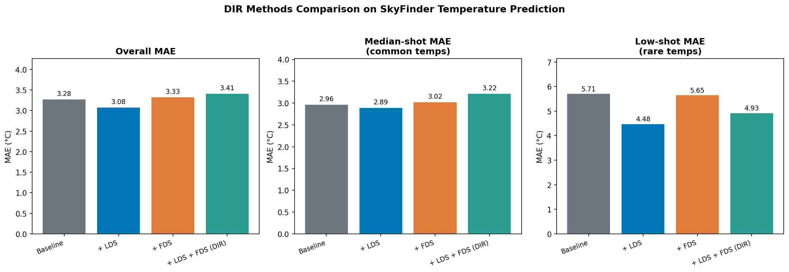
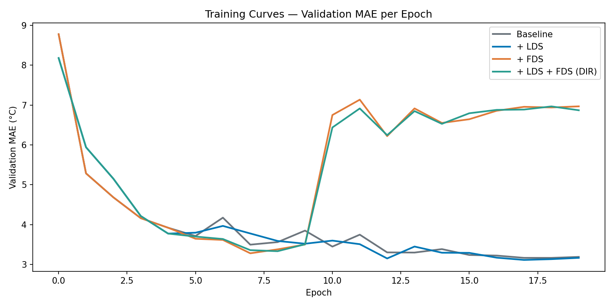
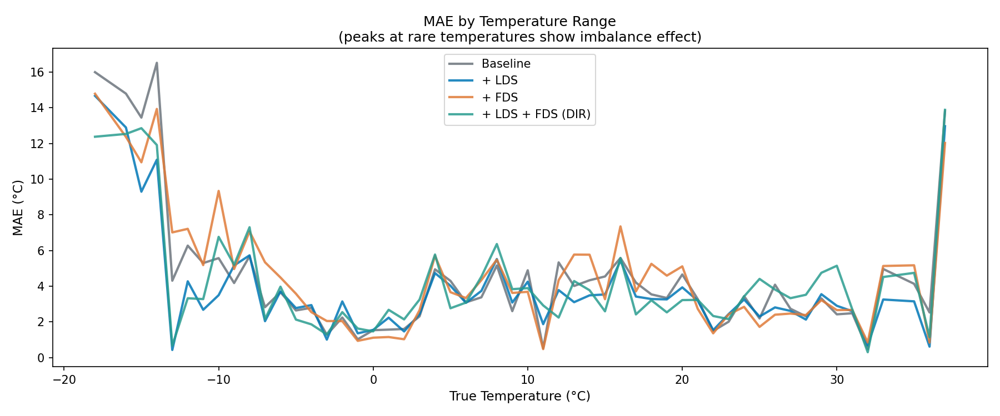
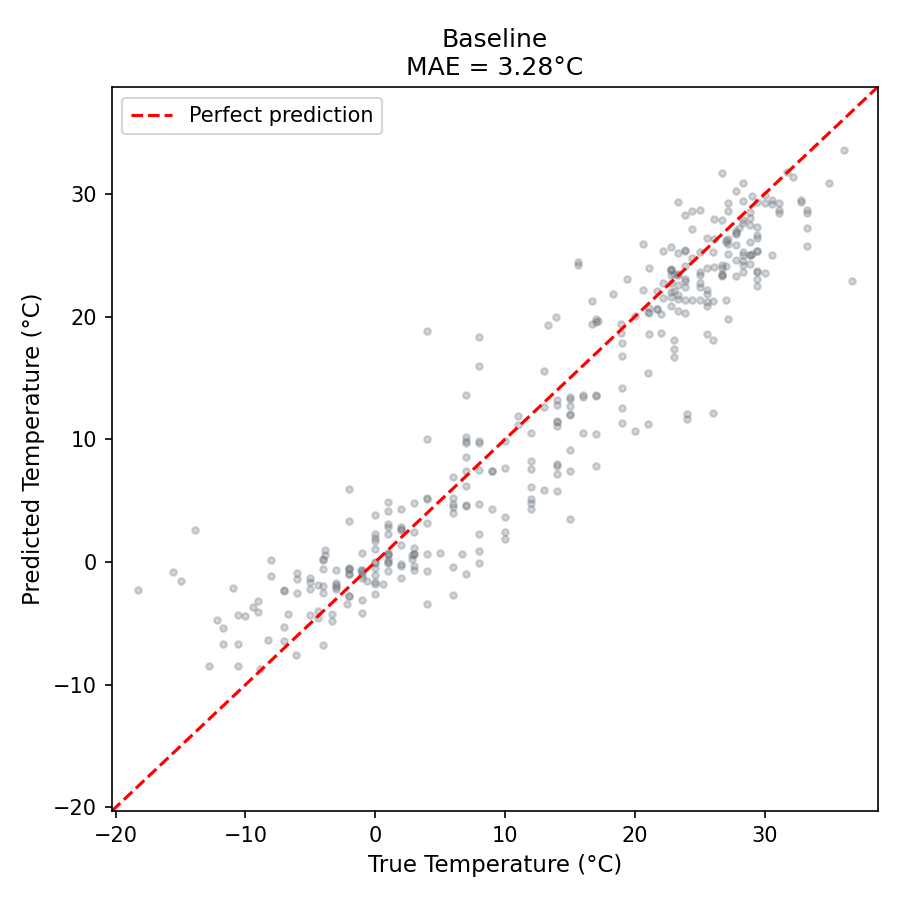
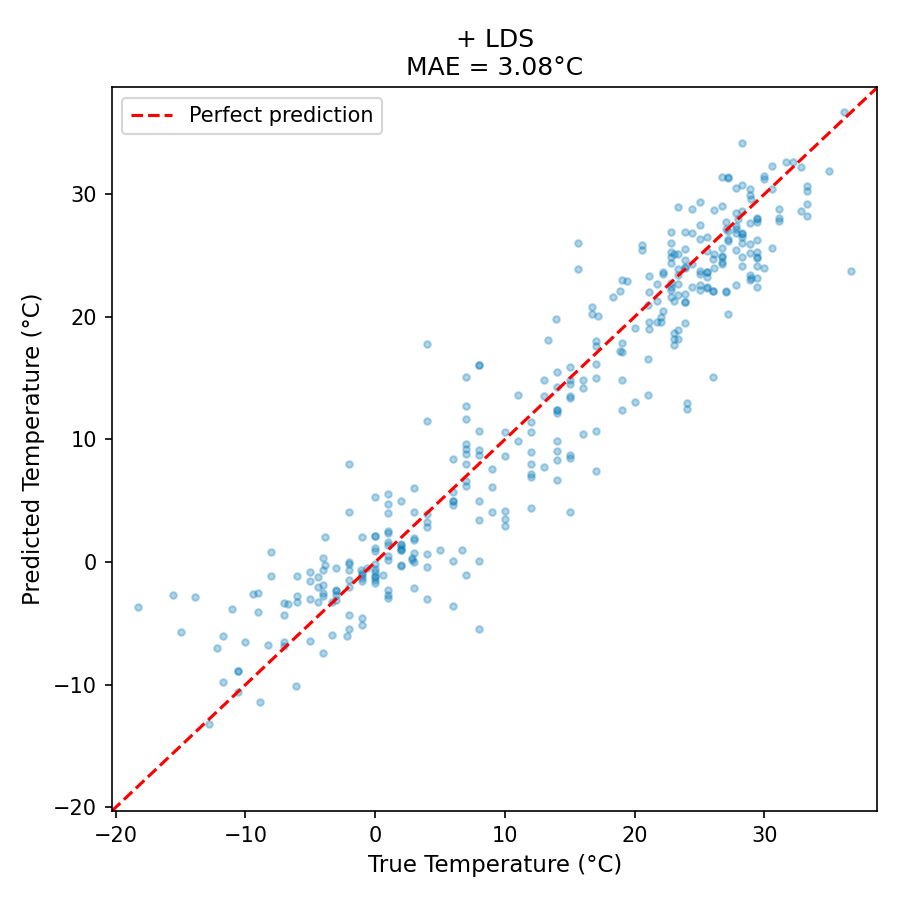

<div align="center">


<br/>

[](https://python.org)
[](https://pytorch.org)
[](https://dir.csail.mit.edu/)
[](https://yang-ai-lab.github.io)
[](LICENSE)

<br/>

> 🎯 **Take-home test submission for Prof. Yuzhe Yang — Health Intelligence Lab, UCLA**
> Adapting the DIR framework (Yang et al., ICML 2021) to outdoor temperature prediction from sky images.

<br/>

</div>

---

## 🌤️ What Is This?

Standard regression models **silently fail** on rare labels.

They see thousands of mild-temperature sky photos (15°C–20°C) and almost none from extreme cold (−20°C) or scorching heat (40°C+). The model learns the easy stuff and ignores the hard stuff — a classic imbalanced regression problem.

This repo adapts **[Deep Imbalanced Regression (DIR)](https://dir.csail.mit.edu/)** to fix exactly that.

```
📸 Sky Image  →  🌡️ Predict Temperature (°C)
```

| | |
|---|---|
| 📊 **Dataset** | SkyFinder — 2,400 images, 10 cameras, −27°C to +50°C |
| ⚠️ **Problem** | Label distribution skewed 30:1 toward mild temperatures |
| 🔧 **Solution** | LDS + FDS from the DIR paper |
| 🏆 **Best Result** | LDS → **21.5% improvement** on rare temperatures |

---

## 📊 Key Results

<div align="center">

| Method | Test MAE ↓ | RMSE ↓ | G-Mean ↓ | Median-shot MAE ↓ | Low-shot MAE ↓ |
|:---|:---:|:---:|:---:|:---:|:---:|
| Baseline | 3.279°C | 4.390°C | 2.061 | 2.965°C | 5.713°C |
| 🥇 **+ LDS** | **3.079°C** | **4.081°C** | **1.934** | **2.894°C** | **4.481°C** |
| + FDS | 3.326°C | 4.415°C | 2.014 | 3.024°C | 5.653°C |
| + LDS + FDS (DIR) | 3.413°C | 4.468°C | 2.112 | 3.218°C | 4.930°C |

</div>

> 🏆 **LDS wins on every single metric.** Low-shot MAE improved by **−1.23°C (21.5%)** — the exact regime where imbalance hurts most.

---

## 🔬 Most Interesting Finding

> **FDS with default settings caused 128% MAE degradation (3.28 → 7.47°C)**

### Why it happened

```
1,680 training images
       ÷
77°C label range
       =
~22 samples per 1°C bucket  ←  WAY too few for 512-dim covariance estimation
```

FDS tries to estimate mean and variance of **512-dimensional feature vectors** per temperature bucket. With only ~22 samples per bucket, the statistics are noise — and smoothing noise into features makes everything worse.

### The fix

```python
# ❌ Default — activates too early, corrupts features
python train.py --fds --start_smooth 1

# ✅ Fixed — wait for stable features first
python train.py --fds --start_update 5 --start_smooth 10 --fds_mmt 0.99
```

> 💡 **Practical rule:** Compute `len(train_data) / label_range` before enabling FDS.
> If average bucket density < 30 samples, delay or skip FDS entirely.

---

## 📈 Visualizations

<div align="center">

### Method Comparison


### Training Curves — Note the FDS spike at epoch 10 🔍


### MAE by Temperature Range — Peaks = Rare bins = Imbalance effect


### Predicted vs True Temperature



</div>

---

## 🚀 Quickstart

```bash
# 1. Create virtual environment
python -m venv venv
venv\Scripts\activate        # Windows
# source venv/bin/activate   # Mac/Linux

# 2. Install dependencies
pip install torch torchvision scipy scikit-learn matplotlib tqdm requests Pillow pandas

# 3. Download SkyFinder data (~2,400 images)
cd skyfinder_dir
python prepare_data.py

# 4. Run all 4 experiments automatically
run_all.bat

# 5. Generate plots + comparison table
python analyze.py
```

### Run individually
```bash
# Baseline
python train.py --experiment baseline --epochs 20 --batch_size 32

# + LDS (best result)
python train.py --experiment lds --epochs 20 --batch_size 32 --lds --reweight sqrt_inv

# + FDS (with corrected hyperparameters)
python train.py --experiment fds --epochs 20 --batch_size 32 --fds --start_update 5 --start_smooth 10 --fds_mmt 0.99

# + LDS + FDS (full DIR)
python train.py --experiment dir --epochs 20 --batch_size 32 --lds --reweight sqrt_inv --fds --start_update 5 --start_smooth 10 --fds_mmt 0.99
```

---

## 🗂️ Repo Structure

```
skyfinder-temperature-dir/
│
├── 📁 skyfinder_dir/
│   ├── prepare_data.py     ← Download SkyFinder images + build CSV
│   ├── datasets.py         ← PyTorch Dataset with LDS weighting
│   ├── model.py            ← ResNet-18 + regression head + FDS hook
│   ├── fds.py              ← Feature Distribution Smoothing module
│   ├── loss.py             ← Weighted L1 / MSE / Huber / Focal losses
│   ├── train.py            ← Full training loop (LDS + FDS + eval)
│   └── analyze.py          ← Plots + comparison tables
│
├── 📁 results/
│   ├── comparison_bars.png
│   ├── training_curves.png
│   ├── error_by_temp.png
│   ├── scatter_*.png
│   └── summary_table.csv
│
├── 📁 report/
│   └── Manish_Dhatrak_DIR_Report.docx   ← Full written report
│
└── run_all.bat             ← One-click: run all 4 experiments
```

---

## ⚙️ Experiment Config

| Setting | Value |
|---|---|
| Model | ResNet-18 (ImageNet pretrained) |
| Regression head | 512 → 1 linear |
| Optimizer | Adam (lr=1e-4, wd=1e-4) |
| Scheduler | Cosine Annealing |
| Loss | Weighted L1 |
| Batch size | 32 |
| Epochs | 20 |
| Hardware | CPU (no GPU needed) |
| Training time | ~20 min/experiment |

---

## 💡 Proposed Improvements

- 🔢 **Scale to full 94K images** — fixes FDS bucket sparsity entirely
- 🌦️ **Multi-modal fusion** — add humidity, dew point, wind speed as auxiliary features
- 🗓️ **Temporal conditioning** — use month + hour + GPS as positional embeddings
- 🔁 **Temperature-contrastive pretraining** — push features from different temp bins apart
- 📉 **Uncertainty estimation** — Gaussian output head for calibrated confidence

---

## 📄 Reference

```bibtex
@inproceedings{yang2021delving,
  title={Delving into Deep Imbalanced Regression},
  author={Yang, Yuzhe and Zha, Kaiwen and Chen, Ying-Cong and Wang, Hao and Katabi, Dina},
  booktitle={International Conference on Machine Learning (ICML)},
  year={2021}
}
```

---

## 👨‍💻 Author

<div align="center">

**Manish Dhatrak**

B.Tech Electronics & Computer Engineering | Sanjivani College of Engineering
Research Intern @ NTU Singapore | NASA AIR 1 | Google DeepMind M2L 2025

[](https://manishportfolio-green.vercel.app/)
[](https://www.linkedin.com/in/manish-dhatrak-b759171aa/)
[](mailto:manishdhatrak1121@gmail.com)
[](https://github.com/astromanu007)

<br/>

*Submitted as take-home test for the Health Intelligence Lab internship @ UCLA*

</div>
